# Flowchart Diagrams

## 1_job_seeker_onboarding.mmd

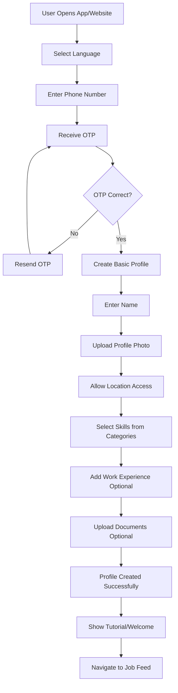

## 2_job_discovery.mmd

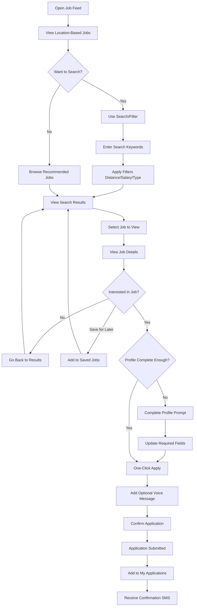

## 3_job_provider_registration.mmd

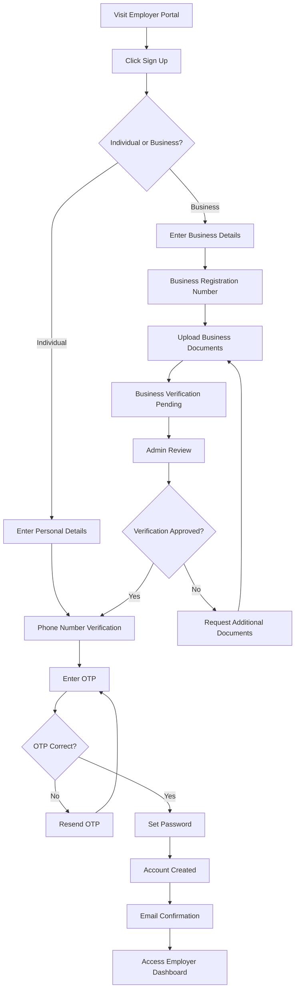

## 4_job_posting.mmd

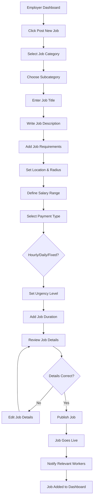

## 5_candidate_management.mmd

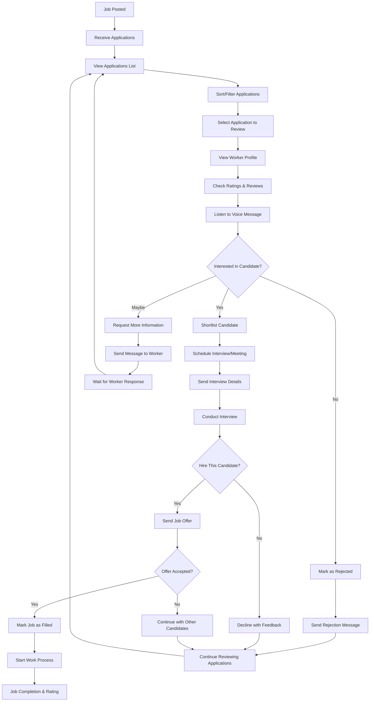

## 6_admin_user_management.mmd

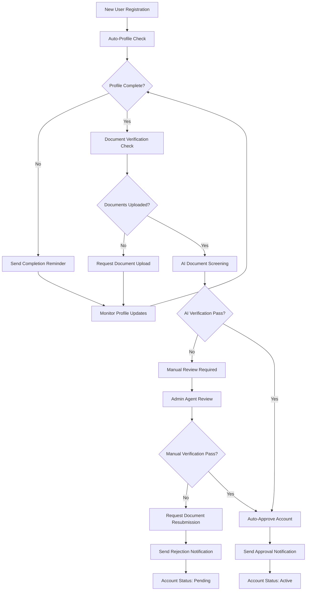

## 7_content_moderation.mmd

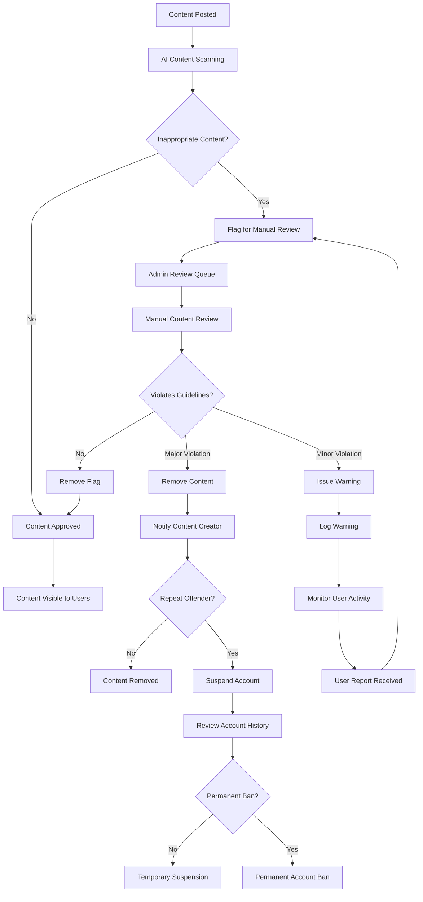

## 8_document_verification.mmd

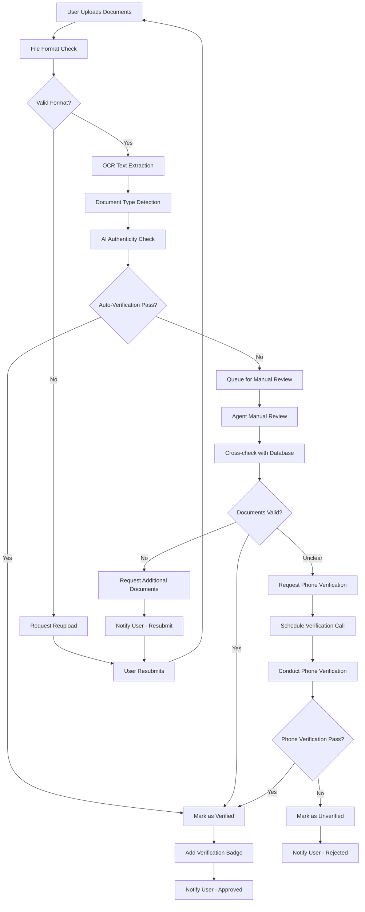

## 9_skill_verification.mmd

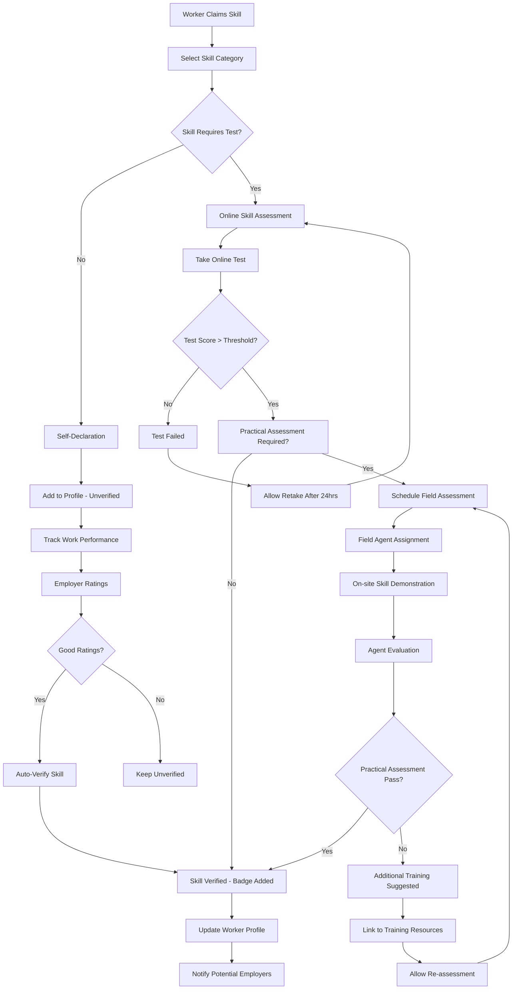

## 10_communication_messaging.mmd

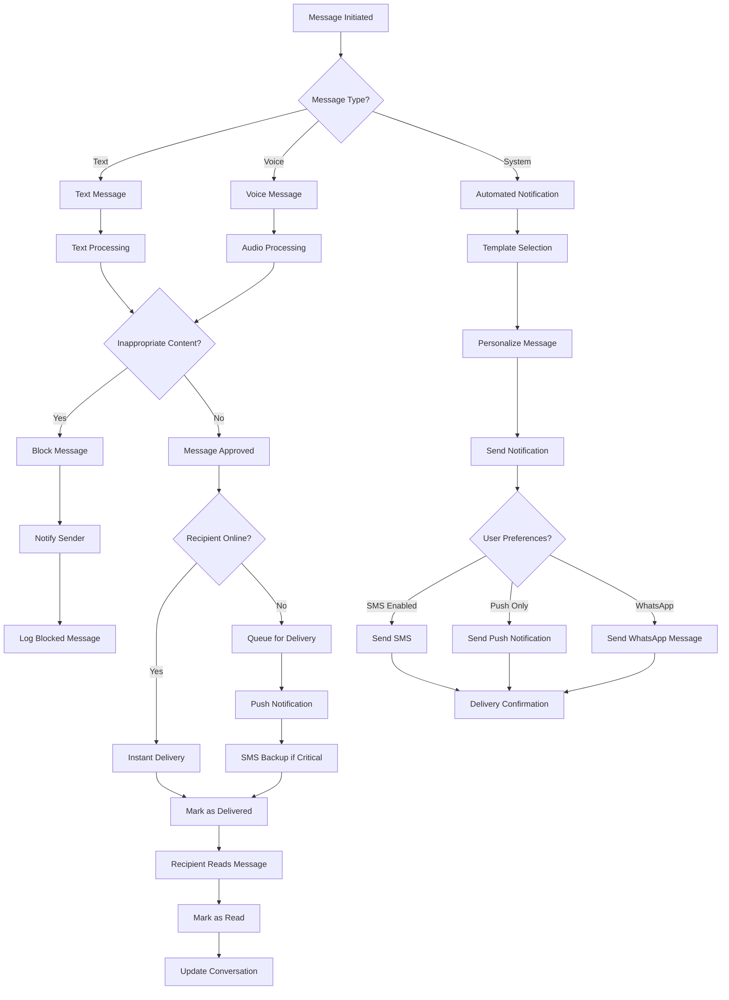

## 11_payment_transactions.mmd

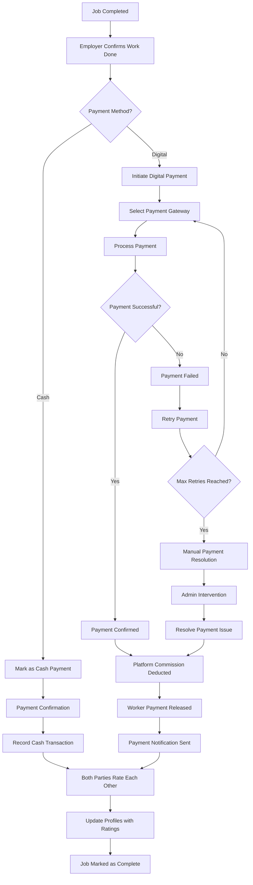

---
## System Integration Points

### Key Integration Requirements:
1. **SMS Gateway** - OTP verification, notifications
2. **Payment Gateway** - UPI, cards, digital wallets
3. **Maps API** - Location services, distance calculations
4. **Cloud Storage** - Document and media storage
5. **Push Notification Service** - Real-time alerts
6. **Voice Services** - Speech-to-text, text-to-speech
7. **Document Verification APIs** - Aadhaar, PAN verification
8. **Analytics Platform** - User behavior tracking

### Mobile App Specific Considerations:
- **Offline Capability** - Core functions work without internet
- **Low Bandwidth Optimization** - Compressed images, minimal data usage
- **Regional Language Support** - UI and voice in local languages
- **Accessibility Features** - Voice navigation, large text options
- **Battery Optimization** - Efficient background processes

